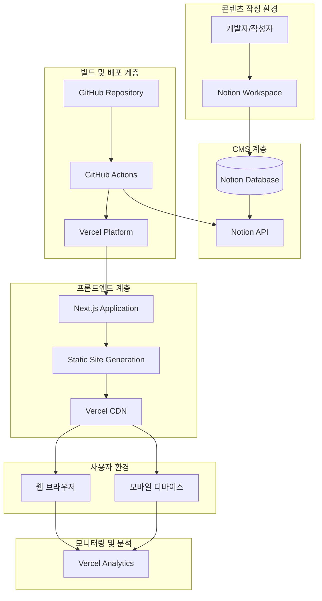
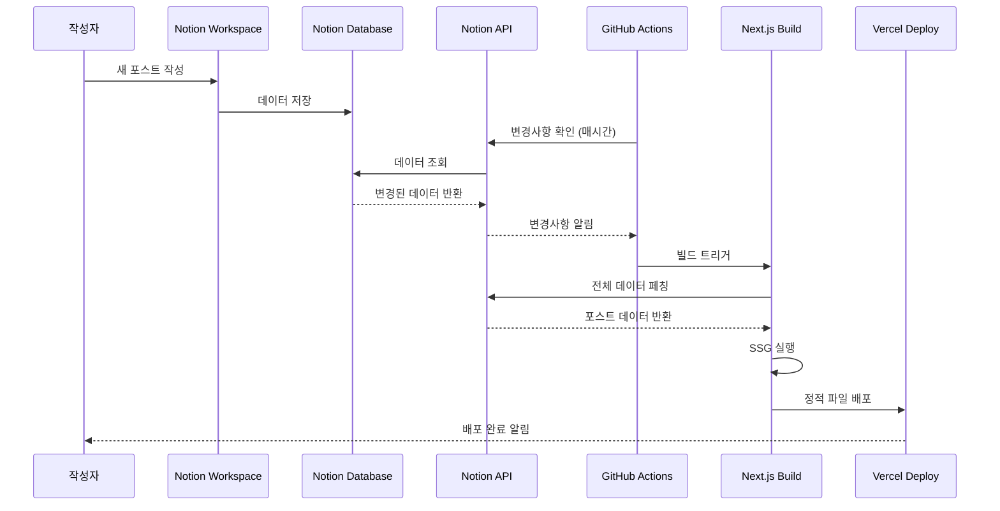
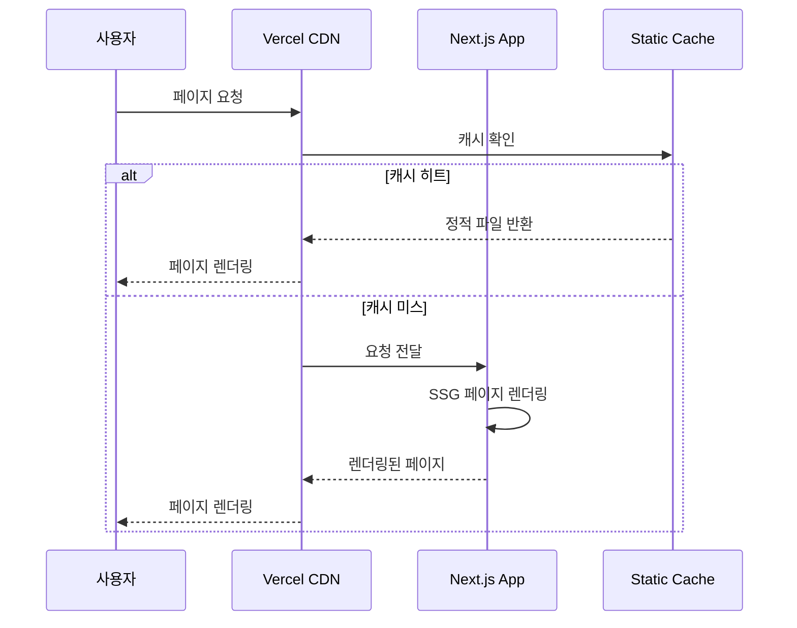
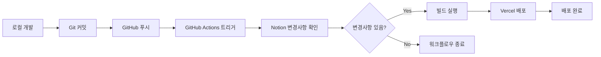

# 개발 기술 블로그 시스템 아키텍처

## 1. 아키텍처 개요

### 1.1 시스템 비전

Notion을 CMS로 활용한 개인 기술 블로그 시스템으로, SSG(Static Site Generation) 기반의 고성능 웹사이트를 구축합니다. 개발자의 콘텐츠 작성 편의성과 사용자의 최적화된 읽기 경험을 동시에 제공하는 것이 핵심 목표입니다.

### 1.2 핵심 아키텍처 원칙

- **콘텐츠 중심 설계**: Notion Database를 단일 진실 소스(Single Source of Truth)로 활용
- **성능 우선**: SSG를 통한 정적 사이트 생성으로 최적의 로딩 속도 보장
- **자동화 중심**: GitHub Actions를 통한 무중단 배포 파이프라인
- **개발자 경험**: 친숙한 Notion UI를 통한 콘텐츠 작성
- **사용자 경험**: 다크모드, 반응형 디자인, SEO 최적화

### 1.3 기술 스택 요약

| 계층         | 기술 스택                            | 역할                       |
| ------------ | ------------------------------------ | -------------------------- |
| **Frontend** | Next.js 14+ (App Router), TypeScript | 정적 사이트 생성 및 렌더링 |
| **CMS**      | Notion API                           | 콘텐츠 관리 및 저장        |
| **스타일링** | Tailwind CSS + next-themes           | 반응형 디자인 및 다크모드  |
| **빌드**     | Next.js SSG                          | 정적 사이트 생성           |
| **배포**     | Vercel + GitHub Actions              | 자동 배포 및 호스팅        |
| **모니터링** | Vercel Analytics                     | 성능 및 사용량 추적        |

---

## 2. 시스템 아키텍처 다이어그램



---

## 3. 컴포넌트 아키텍처

### 3.1 프론트엔드 컴포넌트 구조

```mermaid
graph TD
    subgraph "App Router 구조"
        Layout[app/layout.tsx]
        HomePage[app/page.tsx]
        PostPage[app/posts/[slug]/page.tsx]
        CategoryPage[app/category/[category]/page.tsx]
        AboutPage[app/about/page.tsx]

        Layout --> HomePage
        Layout --> PostPage
        Layout --> CategoryPage
        Layout --> AboutPage
    end

    subgraph "공통 컴포넌트"
        Header[components/Header.tsx]
        Footer[components/Footer.tsx]
        ThemeToggle[components/ThemeToggle.tsx]
        PostCard[components/PostCard.tsx]
        PostContent[components/PostContent.tsx]

        Layout --> Header
        Layout --> Footer
        Header --> ThemeToggle
        HomePage --> PostCard
        PostPage --> PostContent
    end

    subgraph "유틸리티 레이어"
        NotionClient[lib/notion.ts]
        MarkdownParser[lib/markdown.ts]
        ThemeManager[lib/themes.ts]
        Utils[lib/utils.ts]

        PostPage --> NotionClient
        PostContent --> MarkdownParser
        ThemeToggle --> ThemeManager
    end
```

### 3.2 데이터 모델 설계

#### 3.2.1 Notion Database 스키마

```typescript
interface NotionPost {
  id: string;
  title: string;
  slug: string;
  published: boolean;
  createdAt: string;
  updatedAt: string;
  category: string;
  tags: string[];
  excerpt?: string;
  coverImage?: string;
  readingTime?: number;
}

interface NotionBlock {
  id: string;
  type: string;
  content: any;
  children?: NotionBlock[];
}
```

#### 3.2.2 애플리케이션 데이터 타입

```typescript
interface BlogPost {
  id: string;
  title: string;
  slug: string;
  content: string;
  excerpt: string;
  publishedAt: Date;
  updatedAt: Date;
  category: Category;
  tags: Tag[];
  coverImage?: string;
  readingTime: number;
  toc: TableOfContentsItem[];
}

interface Category {
  name: string;
  slug: string;
  postCount: number;
}

interface Tag {
  name: string;
  slug: string;
  postCount: number;
}
```

---

## 4. 데이터 플로우 아키텍처

### 4.1 콘텐츠 생성 플로우



### 4.2 사용자 요청 플로우



---

## 5. API 설계

### 5.1 Notion API 연동 설계

```typescript
// lib/notion.ts - 핵심 API 함수들
class NotionClient {
  private client: Client;
  private databaseId: string;

  // 포스트 메타데이터 조회
  async getAllPosts(): Promise<NotionPost[]>;

  // 특정 포스트 상세 조회
  async getPostBySlug(slug: string): Promise<BlogPost>;

  // 포스트 콘텐츠 변환
  async getPostContent(pageId: string): Promise<string>;

  // 카테고리 목록 조회
  async getCategories(): Promise<Category[]>;

  // 카테고리별 포스트 필터링
  async getPostsByCategory(category: string): Promise<BlogPost[]>;

  // 태그별 포스트 필터링
  async getPostsByTag(tag: string): Promise<BlogPost[]>;
}
```

### 5.2 Next.js API Routes 설계

```typescript
// app/api/posts/route.ts
export async function GET() {
  const posts = await notionClient.getAllPosts();
  return Response.json(posts);
}

// app/api/posts/[slug]/route.ts
export async function GET(request: Request, { params }: { params: { slug: string } }) {
  const post = await notionClient.getPostBySlug(params.slug);
  return Response.json(post);
}

// app/api/categories/route.ts
export async function GET() {
  const categories = await notionClient.getCategories();
  return Response.json(categories);
}
```

---

## 6. 성능 최적화 아키텍처

### 6.1 SSG 최적화 전략

```typescript
// app/posts/[slug]/page.tsx
export async function generateStaticParams() {
  const posts = await notionClient.getAllPosts();
  return posts.map((post) => ({
    slug: post.slug,
  }));
}

export async function generateMetadata({ params }: { params: { slug: string } }) {
  const post = await notionClient.getPostBySlug(params.slug);
  return {
    title: post.title,
    description: post.excerpt,
    openGraph: {
      title: post.title,
      description: post.excerpt,
      images: post.coverImage ? [post.coverImage] : [],
    },
  };
}
```

### 6.2 이미지 최적화

```typescript
// components/OptimizedImage.tsx
import Image from "next/image";

interface OptimizedImageProps {
  src: string;
  alt: string;
  width?: number;
  height?: number;
}

export function OptimizedImage({ src, alt, width, height }: OptimizedImageProps) {
  return (
    <Image
      src={src}
      alt={alt}
      width={width || 800}
      height={height || 400}
      priority={false}
      placeholder="blur"
      blurDataURL="data:image/jpeg;base64,..."
    />
  );
}
```

### 6.3 코드 스플리팅 전략

```typescript
// 동적 임포트를 통한 코드 스플리팅
const CodeHighlight = dynamic(() => import("./CodeHighlight"), {
  loading: () => <div>Loading...</div>,
});

const SearchComponent = dynamic(() => import("./SearchComponent"), {
  ssr: false, // 클라이언트 사이드에서만 렌더링
});
```

---

## 7. 다크모드 아키텍처

### 7.1 테마 관리 시스템

```typescript
// lib/themes.ts
import { ThemeProvider } from "next-themes";

export function ThemeProviderWrapper({ children }: { children: React.ReactNode }) {
  return (
    <ThemeProvider attribute="class" defaultTheme="system" enableSystem={true} disableTransitionOnChange={false}>
      {children}
    </ThemeProvider>
  );
}

// hooks/useTheme.ts
export function useTheme() {
  const { theme, setTheme, resolvedTheme } = useTheme();

  return {
    theme,
    setTheme,
    resolvedTheme,
    isDark: resolvedTheme === "dark",
    toggleTheme: () => setTheme(theme === "dark" ? "light" : "dark"),
  };
}
```

### 7.2 CSS 변수 기반 테마 시스템

```css
/* globals.css */
:root {
  --background: #ffffff;
  --foreground: #0f0f23;
  --primary: #3b82f6;
  --secondary: #64748b;
  --muted: #f1f5f9;
  --border: #e2e8f0;
}

.dark {
  --background: #0f0f23;
  --foreground: #f9fafb;
  --primary: #60a5fa;
  --secondary: #94a3b8;
  --muted: #1e293b;
  --border: #334155;
}
```

---

## 8. 배포 및 인프라 아키텍처

### 8.1 GitHub Actions 워크플로우

```yaml
# .github/workflows/deploy.yml
name: Deploy Blog

on:
  schedule:
    - cron: "0 * * * *" # 매시간 실행
  workflow_dispatch: # 수동 실행 가능

jobs:
  check-changes:
    runs-on: ubuntu-latest
    steps:
      - uses: actions/checkout@v4
      - name: Check Notion Changes
        run: |
          # Notion API로 변경사항 확인
          node scripts/check-notion-changes.js
        env:
          NOTION_API_KEY: ${{ secrets.NOTION_API_KEY }}
          NOTION_DATABASE_ID: ${{ secrets.NOTION_DATABASE_ID }}

  build-and-deploy:
    needs: check-changes
    if: steps.check-changes.outputs.has-changes == 'true'
    runs-on: ubuntu-latest
    steps:
      - uses: actions/checkout@v4
      - uses: actions/setup-node@v4
        with:
          node-version: "18"
      - name: Install dependencies
        run: npm ci
      - name: Build
        run: npm run build
        env:
          NOTION_API_KEY: ${{ secrets.NOTION_API_KEY }}
          NOTION_DATABASE_ID: ${{ secrets.NOTION_DATABASE_ID }}
      - name: Deploy to Vercel
        uses: amondnet/vercel-action@v25
        with:
          vercel-token: ${{ secrets.VERCEL_TOKEN }}
          vercel-org-id: ${{ secrets.VERCEL_ORG_ID }}
          vercel-project-id: ${{ secrets.VERCEL_PROJECT_ID }}
```

### 8.2 환경 변수 관리

```bash
# .env.local (로컬 개발)
NOTION_API_KEY=secret_xxxxx
NOTION_DATABASE_ID=xxxxx
NEXT_PUBLIC_SITE_URL=http://localhost:3000

# Vercel 환경 변수 (프로덕션)
NOTION_API_KEY=secret_xxxxx
NOTION_DATABASE_ID=xxxxx
NEXT_PUBLIC_SITE_URL=https://yourblog.com
NEXT_PUBLIC_GA_ID=G-XXXXXXXXXX
```

---

## 9. 보안 아키텍처

### 9.1 API 보안

```typescript
// lib/notion.ts - API 키 보안
class NotionClient {
  private client: Client;

  constructor() {
    if (!process.env.NOTION_API_KEY) {
      throw new Error("NOTION_API_KEY is required");
    }

    this.client = new Client({
      auth: process.env.NOTION_API_KEY,
    });
  }

  // Rate limiting 구현
  private async rateLimitCheck() {
    // 초당 3 requests 제한 준수
    await new Promise((resolve) => setTimeout(resolve, 334));
  }
}
```

### 9.2 환경 변수 보안

- Notion API Key는 서버 사이드에서만 사용
- 클라이언트 사이드에는 공개 가능한 변수만 노출
- Vercel Secrets를 통한 안전한 환경 변수 관리

---

## 10. 모니터링 및 분석

### 10.1 성능 모니터링

```typescript
// lib/analytics.ts
import { Analytics } from "@vercel/analytics/react";

export function AnalyticsProvider({ children }: { children: React.ReactNode }) {
  return (
    <>
      {children}
      <Analytics />
    </>
  );
}
```

### 10.2 에러 추적

```typescript
// lib/error-tracking.ts
export function trackError(error: Error, context?: any) {
  console.error("Error tracked:", error, context);
  // 향후 Sentry 등 에러 추적 서비스 연동 가능
}
```

---

## 11. 확장성 고려사항

### 11.1 콘텐츠 증가 대응

- **페이지네이션**: 포스트 수 증가 시 페이지네이션 구현
- **ISR (Incremental Static Regeneration)**: 필요 시 점진적 정적 재생성 도입
- **캐싱 전략**: Notion API 응답 캐싱으로 성능 최적화

### 11.2 기능 확장 계획

- **검색 기능**: Fuse.js를 통한 클라이언트 사이드 검색
- **댓글 시스템**: Giscus 연동
- **RSS 피드**: 자동 생성 및 제공
- **다국어 지원**: i18n 라이브러리 도입

---

## 12. 개발 및 배포 프로세스

### 12.1 개발 워크플로우



### 12.2 품질 보증

- **TypeScript**: 타입 안전성 보장
- **ESLint**: 코드 품질 관리
- **Prettier**: 코드 포맷팅 일관성
- **Husky**: Git 훅을 통한 품질 검사

---

## 13. 결론

이 아키텍처는 Notion을 CMS로 활용한 개인 기술 블로그의 완전한 시스템 설계를 제공합니다. SSG 기반의 고성능 웹사이트와 자동화된 배포 파이프라인을 통해 개발자의 콘텐츠 작성 편의성과 사용자의 최적화된 읽기 경험을 동시에 달성할 수 있습니다.

핵심 강점:

- **단순성**: Notion의 친숙한 UI를 통한 콘텐츠 관리
- **성능**: SSG를 통한 최적의 로딩 속도
- **자동화**: GitHub Actions를 통한 무중단 배포
- **확장성**: 점진적 기능 확장 가능한 구조
- **유지보수성**: 명확한 컴포넌트 분리와 타입 안전성

---

**아키텍처 버전**: 1.0  
**작성일**: 2025-01-26  
**작성자**: Winston (System Architect)  
**검토자**: Sarah (Product Owner)  
**기반 문서**: PRD v1.1
