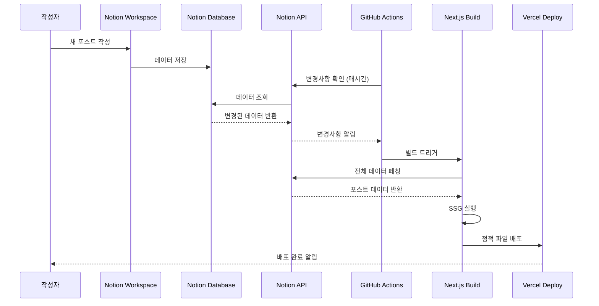
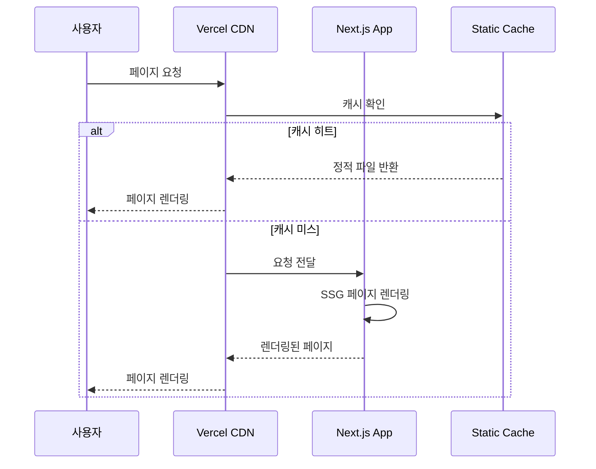

# 데이터 플로우 아키텍처

## 콘텐츠 생성 플로우

```mermaid
sequenceDiagram
    participant Author as 작성자
    participant Notion as Notion Workspace
    participant DB as Notion Database
    participant API as Notion API
    participant GitHub as GitHub Actions
    participant Build as Next.js Build
    participant Deploy as Vercel Deploy

    Author->>Notion: 새 포스트 작성
    Notion->>DB: 데이터 저장
    GitHub->>API: 변경사항 확인 (매시간)
    API->>DB: 데이터 조회
    DB-->>API: 변경된 데이터 반환
    API-->>GitHub: 변경사항 알림
    GitHub->>Build: 빌드 트리거
    Build->>API: 전체 데이터 페칭
    API-->>Build: 포스트 데이터 반환
    Build->>Build: SSG 실행
    Build->>Deploy: 정적 파일 배포
    Deploy-->>Author: 배포 완료 알림
```

## 사용자 요청 플로우

```mermaid
sequenceDiagram
    participant User as 사용자
    participant CDN as Vercel CDN
    participant App as Next.js App
    participant Cache as Static Cache

    User->>CDN: 페이지 요청
    CDN->>Cache: 캐시 확인
    alt 캐시 히트
        Cache-->>CDN: 정적 파일 반환
        CDN-->>User: 페이지 렌더링
    else 캐시 미스
        CDN->>App: 요청 전달
        App->>App: SSG 페이지 렌더링
        App-->>CDN: 렌더링된 페이지
        CDN-->>User: 페이지 렌더링
    end
```
