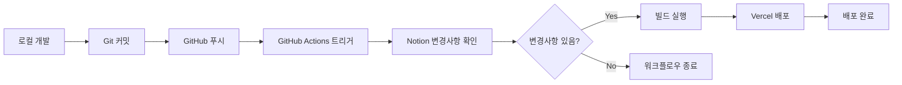

# 개발 및 배포 프로세스

## 개발 워크플로우

```mermaid
graph LR
    A[로컬 개발] --> B[Git 커밋]
    B --> C[GitHub 푸시]
    C --> D[GitHub Actions 트리거]
    D --> E[Notion 변경사항 확인]
    E --> F{변경사항 있음?}
    F -->|Yes| G[빌드 실행]
    F -->|No| H[워크플로우 종료]
    G --> I[Vercel 배포]
    I --> J[배포 완료]
```

## 품질 보증

- **TypeScript**: 타입 안전성 보장
- **ESLint**: 코드 품질 관리
- **Prettier**: 코드 포맷팅 일관성
- **Husky**: Git 훅을 통한 품질 검사
