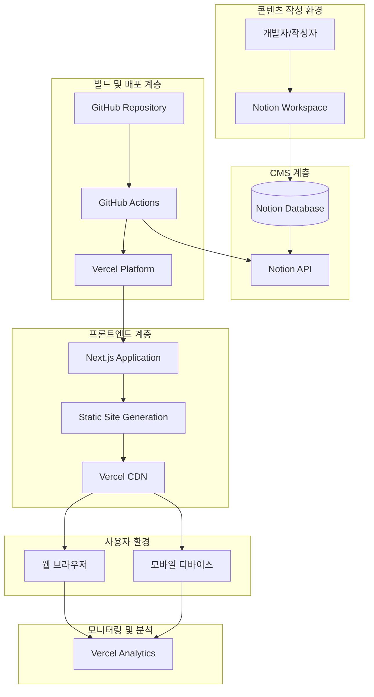

# 시스템 아키텍처 다이어그램

```mermaid
graph TB
    subgraph "콘텐츠 작성 환경"
        Author[개발자/작성자]
        Notion[Notion Workspace]
        Author --> Notion
    end

    subgraph "CMS 계층"
        NotionDB[(Notion Database)]
        NotionAPI[Notion API]
        Notion --> NotionDB
        NotionDB --> NotionAPI
    end

    subgraph "빌드 및 배포 계층"
        GitHub[GitHub Repository]
        GHActions[GitHub Actions]
        Vercel[Vercel Platform]

        GitHub --> GHActions
        GHActions --> NotionAPI
        GHActions --> Vercel
    end

    subgraph "프론트엔드 계층"
        NextJS[Next.js Application]
        SSG[Static Site Generation]
        CDN[Vercel CDN]

        Vercel --> NextJS
        NextJS --> SSG
        SSG --> CDN
    end

    subgraph "사용자 환경"
        Browser[웹 브라우저]
        Mobile[모바일 디바이스]

        CDN --> Browser
        CDN --> Mobile
    end

    subgraph "모니터링 및 분석"
        Analytics[Vercel Analytics]
        Browser --> Analytics
        Mobile --> Analytics
    end
```
